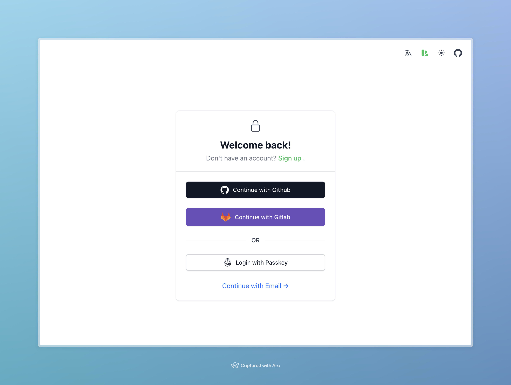
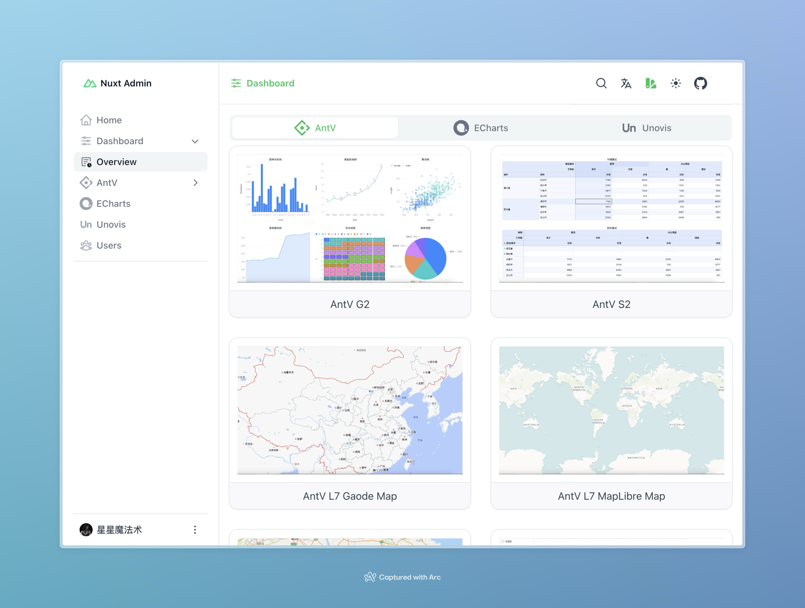

# System built with Nuxt ☑️

A clean, elegant, beautiful and powerful admin template using [Nuxt](https://nuxt.com) 

[](https://xingxing-admin.vercel.app)

## 🚀 Features

- Build visual graphics using [AntV](https://antv.antgroup.com/), [Echarts](https://echarts.apache.org), [Unoivs](https://unovis.dev/)
- Authentication backed-in using [nuxt-auth-utils](https://github.com/atinux/nuxt-auth-utils)
- User interface made with [Nuxt UI](https://ui.nuxt.com)

## 🌐 Live demo

https://xingxing-admin.vercel.app

<p align="left">


</p>

## 🚧 TODO

- [x] Login with Github
- [x] Create chart with AntV
- [x] Create chart with Echarts
- [x] Create chart with Unoivs
- [ ] Sign in with Google
- [ ] Sign in with Email
- [ ] Profile settings

## 🛠️ Setup

Make sure to install the dependencies using [pnpm](https://pnpm.io/):

```bash
pnpm i
```
If you want to use the map, please apply the key from the following map providers:
- [高德地图](https://lbs.amap.com/api/javascript-api-v2/prerequisites) 
- [百度地图](https://lbs.baidu.com/index.php?title=jspopularGL/guide/getkey)
- [Tencent Map](https://lbs.qq.com/webApi/javascriptGL/glGuide/glBasic)

Add the variables in the `.env` file:

```bash
NUXT_GAODE_MAP_TOKEN=
NUXT_BAIDU_MAP_TOKEN=
NUXT_TENCENT_MAP_TOKEN=
```

Create a [GitHub Oauth Application](https://github.com/settings/applications/new) with:
- Homepage url: `http://localhost:3000`
- Callback url: `http://localhost:3000/api/auth/github`

Add the variables in the `.env` file:

```bash
NUXT_OAUTH_GITHUB_CLIENT_ID="my-github-oauth-app-id"
NUXT_OAUTH_GITHUB_CLIENT_SECRET="my-github-oauth-app-secret"
```

To create sealed sessions, you also need to add `NUXT_SESSION_PASSWORD` in the `.env` with at least 32 characters:

```bash
NUXT_SESSION_PASSWORD="your-super-long-secret-for-session-encryption"
```

## 💻 Development

Start the development server on http://localhost:3000

```bash
npm run dev
```

## 📄 License

[MIT License](./LICENSE)
